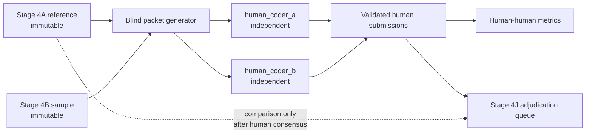

## Purpose

Stage 4H is the project's **blind two-human inter-annotator reliability study**. It is the first layer in which two independent human coders apply the annotation scheme to the same passages without seeing each other's work, the Stage 4A reference annotations, or any model-assisted results.

Stage 4H answers a question no AI-assisted reliability pass can answer: do two trained human readers, working independently under the project's codebook, assign the same metaphor-related lexical units and the same interpretive fields?

## Relation to Stage 4A, Stage 4B, and Stage 4M

The `H` suffix identifies a human-coding branch of Stage 4 reliability work, parallel to the `M` model-review branch.

| Layer | Role | Authority |
| --- | --- | --- |
| **Stage 4A** | Validated sentence- and span-level reference annotations and evidence chains | Canonical reference input; immutable during Stage 4H |
| **Stage 4B** | Codex second-pass sample, adjudication record, and reliability results | AI-assisted within-project context; immutable during Stage 4H |
| **Stage 4M** | Blind comparison across manually operated external model systems | AI-assisted diagnostic stress test; non-authoritative |
| **Stage 4H** | Blind study with two independent human coders | First true human-human inter-annotator reliability layer |
| **Stage 4J** | Post-coding adjudication and codebook revision | Derivative of Stage 4H; may not overwrite Stage 4A |

Stage 4H reads Stage 4B sampling artifacts to select its sample and corpus segment identifiers, but it does not read Stage 4A reference values, Stage 4B adjudications, or Stage 4M comparison outputs before or during human coding. Those values are available only to the adjudicator after both coding sheets are complete.

## Why Stage 4H, Not Stage 4C

A sequential label like Stage 4C would imply a third canonical annotation pass that supersedes or replaces earlier stages. Stage 4H is not a replacement pass. It is a parallel reliability branch, structurally equivalent to Stage 4M's model-review branch. The letter `H` signals that this branch is human-coded; the letter `M` signals that Stage 4M is model-reviewed. Both branches are derivative reliability layers; Stage 4A remains the canonical reference throughout.

Using Stage 4H also allows Stage 4J adjudication, Stage 4M model review, and future reliability branches to carry distinct letters without implying a linear ordering relative to Stage 4A.

## How Stage 4H Differs from Stage 4B and Stage 4M

**Stage 4B** is a Codex second-pass review, not a human-human study. One AI system applies the scheme to the same sample as Stage 4A and flags disagreements for adjudication. The agreement result is AI-assisted within-project reliability, not independent human agreement.

**Stage 4M** extends the AI-assisted approach to multiple external model systems. Model convergence can reveal coding-scheme stability under prompt variation, but AI systems may share training data, architectures, and failure modes. Apparent model consensus is not independent corroboration.

**Stage 4H** is the first layer where two independent human coders, each trained on the codebook and blind to each other's work and to all prior annotation results, apply the scheme to the same passages. Human-human agreement measured under documented blindness conditions is the standard that the project's reliability claim requires.

Until Stage 4H coding is complete, no project publication should claim a completed human inter-annotator reliability result. The current evidence remains the Stage 4B AI-assisted pass and, once submissions are processed, the Stage 4M model-review comparison. Both results are labeled AI-assisted reliability, not human-human inter-annotator reliability.

## Study Design

### Sample

Reuse the five-document Stage 4B sample so human results can be compared against the existing AI-assisted pass without redefining the evidence universe.

| Document | Period | Register |
| --- | --- | --- |
| `doc_001` Lyceum Address | `phase_1_baseline` | `formal_public_address` |
| `doc_006g` Seventh Lincoln-Douglas Debate | `phase_2_argument` | `campaign_speech` |
| `doc_010` July 4 Message 1861 | `phase_3_obligation` | `congressional_message` |
| `doc_017` Gettysburg Address | `phase_4_transformation` | `formal_public_address` |
| `doc_021` Second Inaugural | `phase_5_theodicy` | `formal_public_address` |

The coding units are the 55 sentence-identification units and 51 field-agreement units already defined in `data/reliability/reliability-sample.json`.

### Coders

Two independent human coders, labeled `human_coder_a` and `human_coder_b`.

**Coders receive:**
- The annotation codebook and controlled vocabularies.
- The relevant source sentences or spans from the reliability template.
- The blind coding worksheet generated from the Stage 4B sample.
- A brief instruction sheet based on the [human coder training guide](human-coder-training-guide.md).

**Coders must not receive:**
- Stage 4A annotation JSON or evidence chains.
- Stage 4B adjudications or reliability results.
- Stage 4M model submissions, comparison outputs, or human-queue items.
- The other coder's worksheet at any point before both sheets are submitted.
- Calibration examples drawn from the reliability sample.

### Task Types

The study has two task families, reported separately.

| Task | Unit | Coder action | Reliability question |
| --- | --- | --- | --- |
| Identification | `sentence_identification` | Decide whether the sentence contains a metaphor-related lexical unit; identify narrowest span boundaries | Do human coders find the same units? |
| Field agreement | `field_agreement` | Code a supplied span across MIPVU, CMT, Koenigsberg, absence, confidence, and ambiguity fields | Do human coders assign the same interpretive fields? |

### Blindness Conditions

Coders must remain blind to:
- Stage 4A, Stage 4B, and Stage 4M annotation results throughout.
- Each other's work until both sheets are submitted.
- Calibration examples that overlap with the reliability sample.
- Synthesis claims, adjudication decisions, and claim-audit material.

The adjudicator may inspect Stage 4A and Stage 4B values only after human-human disagreements have been logged. This preserves the independence of the agreement result while still allowing the adjudicator to compare human consensus with the reference layer.

## Coding Artifacts

| Artifact | Role |
| --- | --- |
| `data/reliability/human-double-coding-template.csv` | Blank worksheet for each coder, derived from Stage 4B sample |
| `data/reliability/human-double-coding-completed.csv` | Validated combined submissions from both coders |
| `data/reliability/human-reliability-results.json` | Computed human-human metrics |
| `docs/methodology/human-reliability-results.md` | Rendered human reliability report |

These artifacts are derivative reliability layers and must not overwrite Stage 4A annotation files, Stage 4A evidence chains, or Stage 4B reliability results.

## Metrics

Report identification and interpretation separately. Do not publish one blended inter-annotator score.

| Layer | Required metrics |
| --- | --- |
| Identification | present/absent agreement; Cohen's kappa for present/absent decisions; lexical-unit boundary exact match; boundary overlap match; precision, recall, and F1 against adjudicated consensus |
| CMT mapping | exact `cluster_id` agreement; source-domain family agreement; target-domain family agreement; qualitative entailment overlap |
| Koenigsberg function | exact `fantasy_type` agreement; `violence_logic` agreement; `obligatory_frame` agreement |
| Absence flags | exact set agreement; Jaccard overlap |
| Confidence | confidence-band agreement; mean absolute score difference |

## Current Status

| Item | Status |
| --- | --- |
| Architecture | Designed |
| Training guide | Pending (#87) |
| Calibration packet | Pending (#88) |
| Sampling design | Pending (#89) |
| Blind coding packets | Pending (#90) |
| Human coder recruitment | Not yet |
| Human coding completed | Not yet |
| Human-human metrics | Not yet available |

No publication should claim a completed two-human inter-annotator reliability result until both coding sheets, the adjudication log, and the human metrics exist as validated derivative artifacts.
