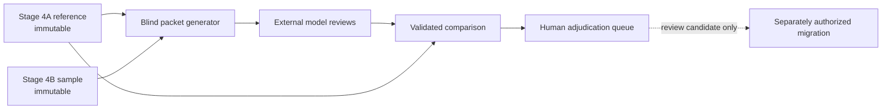

## Purpose

Stage 4M is an **AI-assisted reliability stress test**. It evaluates whether the coding scheme produces stable outputs across multiple model systems. It does not establish human inter-annotator reliability and does not treat AI output as evidence about Lincoln's rhetoric or as authority over the reference annotations.

The stage asks external model systems to review the same blind packet, validates their structured responses, and measures where their judgments converge with or diverge from each other and from the Stage 4A reference layer. Its purpose is diagnostic: to locate stable coding rules, fragile interpretive fields, ambiguous passages, prompt-sensitive decisions, and questions that require human review.

Stage 4M is not a new annotation authority. It cannot decide what a passage means, vote an annotation into correctness, or automatically revise any validated corpus file.

## Relation to Stage 4A and Stage 4B

The `M` identifies a model-review branch of the Stage 4 reliability work rather than a later canonical stage.

| Layer | Role | Authority |
| --- | --- | --- |
| **Stage 4A** | Validated sentence- and span-level reference annotations and evidence chains | Canonical reference input; immutable during Stage 4M |
| **Stage 4B** | Existing Codex second-pass sample, adjudication record, and reliability results | AI-assisted within-project reliability context; immutable during Stage 4M |
| **Stage 4M** | Blind comparison across manually operated external model systems | Diagnostic stress test; derivative and non-authoritative |
| **Future human protocol** | A separately designed blind study with independent human coders | Not yet executed; the only route to a human-human inter-annotator reliability claim |

Stage 4M reads Stage 4A evidence and Stage 4B sampling artifacts to build and score the exercise, but it does not supersede either layer. Primary model-vs-reference metrics use immutable Stage 4A coder-A values. Stage 4B adjudications may remain visible as review context, but they do not silently replace that reference.

The separate [human double-coding protocol](human-double-coding-protocol.md) defines the design required for future human-human reliability. The current [Stage 4B reliability report](reliability-report.md) explains the limits of the existing Codex second pass.



## Why This Is Not Human Inter-Annotator Reliability

Human inter-annotator reliability requires independent human coders, documented training, controlled blindness, a shared sampling design, and human adjudication. Stage 4M substitutes none of those requirements. Model systems can share training data, architectures, provider defaults, and characteristic failure modes, so apparent agreement across models is not necessarily independent corroboration.

Model convergence can indicate that a field is easy for the tested systems under the supplied prompt. It cannot establish that humans would apply the field consistently, that the interpretation is historically correct, or that the model families reached their answers independently. Model disagreement can reveal useful pressure points, but it cannot by itself determine whether the problem lies in a passage, the codebook, the prompt, a model, or the Stage 4A reference judgment.

For those reasons, Stage 4M results must always be labeled **AI-assisted model reliability**, never human inter-annotator reliability.

## Model Packet Design

The deterministic generator creates a packet from the committed Stage 4B sample and canonical segmented text. The current packet contains two task families:

- **Sentence identification (55 units):** reviewers independently decide whether each sentence contains a metaphor-related lexical unit and identify its narrowest span.
- **Field agreement (51 units):** reviewers independently code a supplied lexical span across CMT, Koenigsbergian function, violence logic, obligation, agency/absence, confidence, ambiguity, rival reading, and justification fields.

Positive examples and controls are not identified in reviewer-facing files. Packet-unit IDs and permanent corpus sentence IDs allow returned judgments to be checked without exposing Stage 4A audit IDs or answers. The manifest records generator version, source and output hashes, packet identity, prompt hash, task counts, and blindness assertions so a run can be traced to the exact packet it received.

Generate the packet and complete workflow with:

```bash
npm run stage4m
```

The command requires no vendor API key. With no submissions it succeeds with explicit warnings and preserves an **insufficient evidence** state rather than inventing agreement results.

## Blind Review Rules

External reviewers receive only the generated instructions, the two blind packet files, and one JSON or CSV output template. They must not receive:

- Stage 4A annotations or evidence chains;
- Stage 4B completed coding, adjudication, or reliability results;
- previous model submissions;
- comparison, consensus, or human-queue outputs; or
- synthesis and claim-audit material that could reveal expected judgments.

Review runs should begin in fresh sessions without browsing, repository retrieval, or cross-run memory where the interface permits. Reviewers preserve seeded packet, document, sentence, and span identifiers and return only the completed structured template.

The complete operator workflow, filename convention, provenance checklist, and validated examples are in [Running External Stage 4M Model Reviews](model-review-instructions.md).

## Output Schema

Every submission must conform to `schemas/stage4m-model-output.schema.json`. JSON represents one run with an `items` array; CSV flattens the same contract by repeating identical run metadata on every row. Required provenance includes run and model identifiers, provider, model name and version, run date, operator, packet ID and hash, prompt hash, temperature when known, and notes about other settings.

The response contract preserves uncertainty through `metaphor_present`, `confidence`, `ambiguity_flag`, `rival_reading`, and `justification`. Reviewers are not forced into false precision, but they must use the controlled vocabulary and the fields defined by the schema.

Submissions are untrusted external data. Ingestion checks syntax, schema labels, run identity, packet and prompt hashes, corpus and sentence IDs, packet-unit mappings, duplicate responses, and cross-row CSV metadata. Invalid runs remain visible in the validation report but are excluded from normalized comparison data.

## Agreement Metrics

Agreement is reported by layer rather than collapsed into one headline score:

- metaphor identification;
- lexical-unit boundary;
- CMT source domain, target domain, and cluster assignment;
- Koenigsbergian function, violence logic, and obligatory frame;
- agency and absence flags; and
- confidence, ambiguity, and rival-reading presence.

The comparison stage reports model-vs-reference and model-vs-model metrics with explicit denominators. Identification misses remain false negatives rather than disappearing from field-level summaries. Lexical boundaries distinguish exact, partial, absent, and missing spans. A field is not called stable until it has a meaningful comparison denominator.

No aggregate score substitutes for these separate layers. A model can agree on a CMT mapping while disagreeing on its Koenigsbergian function, or identify the same passage while drawing a different lexical boundary; those are methodologically different outcomes.

## Disagreement Typology

Item-level records distinguish disagreement patterns that would be hidden by an aggregate rate. The classifier preserves:

- unanimous or majority agreement with the Stage 4A reference;
- unanimous or majority challenges to the reference;
- split decisions and single-model outliers;
- all-model uncertainty;
- CMT agreement with Koenigsbergian disagreement;
- lexical-span invention or other model hallucination;
- sacrifice, providence, and purification over-reads; and
- every agency/absence dispute.

All-model disagreement with Stage 4A is a **reference challenge**, not a correction. Agency/absence disputes and purification-related interpretations remain mandatory human-review priorities even when models converge.

## Human Adjudication Boundary

The adjudication queue converts substantive disagreements into reviewable records with source context, reference and model values, priority reasons, and fields for a human decision. Model consensus is diagnostic evidence, not a vote.

Stage 4M may write only to its packet, comparison, and adjudication directories plus the generated adjudication guide. A shared symlink-aware guard rejects writes to `corpus/annotated/`, `data/evidence/`, existing Stage 4B files, submission inputs, and any unlisted path.

No model output, consensus report, or queue decision can automatically revise Stage 4A. A proposed correction remains a review candidate under `data/reliability/model-adjudication/`. Applying one requires a separately authorized, documented migration that follows Stage immutability, schema propagation, and validation rules.

## Publication Use

Stage 4M strengthens the publication package by making coding sensitivity inspectable. It can show which fields remain stable across the tested systems, which interpretations are prompt- or model-sensitive, which documents and clusters attract concentrated disagreement, and where the codebook needs clarification. It also makes negative results explicit: **no submissions**, **insufficient evidence**, and **no stable field** are reportable methodological states rather than gaps to conceal.

The publication may use validated Stage 4M outputs to qualify confidence, describe robustness checks, identify limitations, and explain why certain cases were sent to human review. It may not present model agreement as evidence for a historical claim, independent corroboration, human reliability, or permission to alter the reference corpus.

Publication gates include Stage 4M directly. `npm run validate` checks submissions and generated artifacts; `npm run status` reports lifecycle state; `npm run pipeline` validates inputs before rebuilding analytical outputs; and `quarto render` verifies the rendered methodology package.

## Limitations

- The repository currently contains no external model submissions, so Stage 4M is **designed but not executed** and supports no empirical convergence or divergence claim yet.
- Model systems are not independent human coders and may share training data, architectures, provider infrastructure, or prompt-response conventions.
- Results are conditional on the sampled passages, packet construction, prompt, model versions, interface settings, and run date.
- Model-vs-reference metrics inherit the strengths and possible errors of Stage 4A; reference agreement is not synonymous with truth.
- Hidden provider instructions and undisclosed inference settings can limit exact reproducibility even when project provenance is complete.
- The reliability sample does not license corpus-wide frequency claims about model behavior.
- Consensus thresholds and denominators are diagnostic conventions, not epistemic guarantees.
- Human adjudication can identify a correction candidate, but only a separate migration can alter canonical data.

Until validated submissions exist, the appropriate conclusion is limited: the workflow, contracts, safeguards, and reporting states are operational, but multi-model reliability has not yet been measured.
