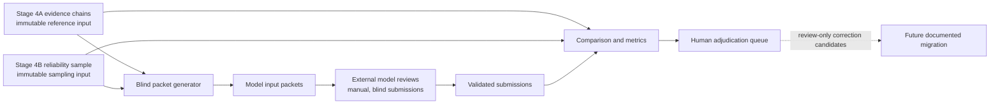

# Stage 4M Multi-Model Reliability Architecture

## Status and Scope

Stage 4M is the multi-model reliability stress-test layer. It uses existing Stage 4A evidence records and Stage 4B reliability artifacts as immutable inputs, packages blind review tasks for external AI model systems, compares returned judgments, and sends substantive disagreements to human review.

Stage 4M is an **AI-assisted diagnostic stress test**. It is not a human inter-annotator reliability study, a source of authoritative annotations, or an automatic correction mechanism. Human-human reliability belongs to a separate future stage with its own blindness, training, sampling, and adjudication controls.

This document defines the architectural boundary for the v2 implementation. Blind input packets are implemented; submission schemas, metrics, and rendered results remain assigned to later issues in the [v2 tracker](https://github.com/ashitaka-emishi/lincoln-metaphor-analysis/issues/85).

Generate the deterministic blind packet with:

```bash
node scripts/stage4m/generate-model-packets.js
```

Validate current submissions without writing generated artifacts, or ingest them and write the comparison-ready outputs, with:

```bash
npm run validate:stage4m
npm run stage4m:ingest
npm run stage4m:compare
npm run stage4m:disagreements
npm run stage4m:queue
```

## Why the Stage Is Called 4M

The `M` identifies a model-review branch of the Stage 4 reliability work. It prevents three ambiguities:

1. **Stage 4C already exists.** It is the textual-variant apparatus, so assigning that identifier to model reliability would overwrite an established methodological meaning.
2. **Stage 4M is not the next canonical annotation stage.** It reads Stage 4A and Stage 4B but does not supersede either one.
3. **Model and human reliability must remain distinguishable.** The mnemonic suffix makes it harder to accidentally describe model agreement as human inter-annotator reliability.

The identifier is therefore categorical, not a claim that Stage 4M produces a later or more authoritative annotation layer.

## What Stage 4M Is and Is Not

| Stage 4M is | Stage 4M is not |
| --- | --- |
| A blind stress test across multiple AI model systems | A two-human blind coding study |
| A way to identify stable and unstable annotation fields | A vote that determines the correct annotation |
| A derivative comparison layer | A replacement for Stage 4A or Stage 4B |
| A source of human-review queues and codebook questions | Permission to edit validated Stage 4 files |
| Runnable from committed packets and manually supplied submissions | A vendor API integration or paid automation requirement |

Agreement is diagnostic rather than authoritative. Repeated agreement may indicate a stable coding rule; repeated disagreement may indicate an ambiguous passage, an underspecified codebook rule, model-family correlation, prompt sensitivity, or a weakness in the Stage 4A reference judgment. None of those interpretations can be selected by model consensus alone.

## Position in the Evidence System



The reference values become available to comparison code only after a model submission has been completed and stored. Blind input packets must not expose Stage 4A answers, Stage 4B second-pass answers, adjudication decisions, synthesis claims, or aggregate results that reveal expected judgments.

## Repository Contract

Stage 4M owns the following paths:

| Path | Responsibility |
| --- | --- |
| `docs/methodology/multi-model-reliability.md` | Architectural and methodological boundary |
| `data/reliability/model-input-packets/` | Deterministically generated blind task packets |
| `data/reliability/model-output-submissions/` | Manually supplied model responses plus provenance metadata |
| `data/reliability/model-comparison/` | Generated model-vs-reference and model-vs-model results |
| `data/reliability/model-adjudication/` | Human-review queues, decisions, and codebook-revision candidates |
| `scripts/stage4m/` | Packet, validation, comparison, reporting, and guardrail scripts |

The generator implemented by issue #68 defines the committed blind input-packet contract. Model submissions use the canonical JSON Schema at `schemas/stage4m-model-output.schema.json`. The generated JSON template follows that shape directly; the CSV template repeats run metadata on every row and maps each row to one `items` entry, as declared by the schema's `x-stage4m-csv` annotation. After comparison and disagreement classification, `npm run stage4m:queue` creates deterministic JSON and CSV review queues, a human completion template, and the rendered adjudication guide. The directory contract is stable: scripts may add files beneath these Stage 4M paths but must not repurpose existing Stage 4A or Stage 4B locations.

`scripts/stage4m/generate-model-consensus-report.js` then synthesizes the agreement results, disagreement log, and human queue into `model-consensus-report.json` and `model-consensus-report.md`. The report separates stable, unstable, and insufficient-evidence fields; ranks document, cluster, and interpretive-category risk; distinguishes all-model challenges from cases where models support the reference; and carries human-review priorities forward. Its consensus language is deliberately non-decisive.

## Immutable Inputs and Write Boundary

Stage 4M may read:

- `data/evidence/annotation-evidence.json` (Stage 4A reference evidence)
- `data/reliability/reliability-sample.json` (Stage 4B sample definition)
- `data/reliability/double-coding-template.csv` and other Stage 4B artifacts when required to reproduce task structure
- canonical corpus metadata and source text needed to render blind context

Stage 4M must never write to:

- `corpus/annotated/`
- `data/evidence/`
- existing Stage 4B files directly under `data/reliability/`
- concordance, analysis, synthesis, or claim-audit outputs

Any proposed annotation correction remains a review-only record under `model-adjudication/`. Applying a correction requires a separately authorized, documented migration that observes the repository's Stage-immutability and schema-propagation rules.

## Blindness and Provenance

Input packets must be reproducible from committed inputs and must separate task material from answer keys. A packet manifest should eventually record source hashes, generator version, task counts, and a deterministic packet identifier without recording reference answers in the reviewer-facing payload.

Every model submission identifies enough provenance to interpret the result: stable run and model identifiers, provider, model name and version, run date, operator, packet identifier and hash, prompt hash, temperature when known, and free-text notes for other generation settings or context. The canonical schema also preserves explicit uncertainty through `metaphor_present`, `confidence`, `ambiguity_flag`, and `rival_reading` rather than forcing a definitive label.

Submissions are untrusted external data. They must be validated before comparison and preserved as submitted after acceptance; normalization belongs in generated comparison artifacts rather than silent rewrites of the submission.

## Execution and Failure Semantics

The Stage 4M lifecycle has five distinguishable states:

1. **Designed** — architecture and directories exist.
2. **Packet-ready** — blind packets can be generated deterministically.
3. **Submission-ready** — model outputs can be ingested and validated.
4. **Comparable** — enough valid submissions exist for model-vs-reference and model-vs-model metrics.
5. **Review-ready** — disagreements and correction candidates are available for human adjudication.

An empty submission directory is expected during setup and produces a clear warning rather than a pipeline failure. Malformed submissions, packet mismatches, provenance failures, or attempted writes outside Stage 4M-owned paths fail validation. Invalid files remain represented in both machine-readable and reviewer-readable validation reports and are never partially admitted to `normalized-model-runs.json`.

## Implementation Constraints

- Manual model review must remain possible without vendor API keys or paid API automation.
- Model-family agreement must not be mistaken for independent corroboration.
- Agreement is reported by identification, lexical-boundary, CMT, Koenigsberg, agency/absence, and confidence/ambiguity layers; no single aggregate score substitutes for those denominators.
- Primary model-vs-reference metrics use immutable Stage 4A coder-A values. Stage 4B adjudications remain visible as review context but do not silently replace the reference layer.
- Item-level disagreement records distinguish methodological disagreement from consensus: all-model challenges to Stage 4A, CMT-agree/Koenigsberg-disagree cases, sacrifice/providence/purification over-reads, and every agency/absence dispute remain explicit human-review priorities.
- Identification agreement, CMT mapping, Koenigsbergian interpretation, agency/absence flags, and confidence must remain separately reportable rather than collapsed into one score.
- Negative controls and prompt/run variation may be added later, but they must be labeled and reported separately from primary review runs.
- No model output, consensus result, or adjudication queue may automatically revise Stage 4A.
- Stage 4M scripts must use explicit, allowlisted output paths under the repository contract above.

## Follow-Up Issue Boundaries

This architecture intentionally leaves implementation to the ordered v2 issues:

- #68 generates blind input packets and establishes the packet-ready state.
- #69 defines the model-output schema and JSON/CSV field mapping.
- #70 ingests and validates JSON/CSV submissions and generates normalized runs plus validation reports.
- #71 computes layered model-vs-reference and model-vs-model agreement; #72 classifies item-level disagreement and instability; #73 creates the human queue; #81 synthesizes those artifacts into the model consensus report.
- #74 and #79 integrate commands and publication-gate validation.
- #80 verifies overwrite guardrails across the completed scripts.
- #75–#78 and #82–#84 complete instructions, rendered reporting, codebook notes, publication integration, and release checks.

Stage 4M is now **packet-ready**, **submission-ready**, and capable of generating the human-review queue. It is not comparable while no valid model submissions exist. No multi-model reliability result should be claimed until validated submissions and comparison outputs exist.
