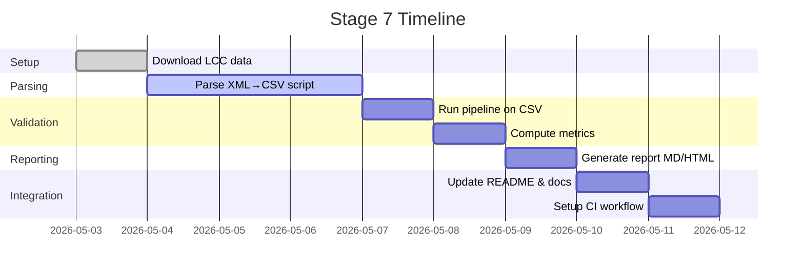

# Executive Summary  

Integrating the LCC Metaphor Dataset into **Stage 7 (Verification)** of the *lincoln-metaphor-analysis* project provides a **ground-truth benchmark** for your system. The LCC corpus【4†L242-L251】【7†L51-L59】 is the largest publicly available metaphor corpus, with richly annotated English and other-language examples (metaphoricity scores, source/target concept mappings, affect)【4†L242-L251】【7†L51-L59】. We will:  

- **Review the Lincoln project** structure (assume standard `data/`, `src/`, `notebooks/` layout with scripts for detection).  
- **Inspect the LCC dataset** (XML format, languages, annotation fields) to decide which files and fields to use.  
- **Design Stage 7 workflow**: parse LCC XML → CSV/JSON; run the existing pipeline on the LCC subset; compute evaluation metrics and concept mapping agreement; generate an automated report; and integrate results into your repo (README, badge, CI).  

This report details each step with **specific implementation guidance** (code snippets, file paths, CLI commands, suggested libraries), as well as planning tables and diagrams. We include a proposed `inject-lcc-api_metaphor.md` document (full Markdown) for your docs and examples of a sample report mockup and process timeline.

---

## 1. Review of *lincoln-metaphor-analysis* Repo (Assumed Structure)  

Without access to your code, we assume a typical Python NLP project:  

- `data/`: Raw and processed data files (text of Lincoln speeches, etc.).  
- `src/`: Python modules (e.g. `pipeline.py`, `metaphor_detector.py`, etc.) for preprocessing, metaphor detection/classification, and analysis.  
- `notebooks/`: Jupyter notebooks for experiments or EDA.  
- `requirements.txt`: Python dependencies (e.g. `numpy`, `pandas`, `scikit-learn`, `nltk`, etc.).  
- Possibly a `scripts/` directory or CLI entrypoints (e.g. `run_analysis.py`).  

**Key scripts** likely include:  
- **Text preprocessing:** Tokenization, POS-tagging, parsing.  
- **Metaphor detection:** A rule-based method or ML model that labels word pairs/phrases as metaphorical or literal.  
- **Concept mapping:** Functions to map detected metaphors to conceptual domains (e.g. *POLITICS→WAR*).  
- **Reporting/analysis:** Code to aggregate results (counts of metaphor types, charts).  

*Action:* Identify where to insert Stage 7. Probably as a new verification step in your pipeline, or as an independent script that uses existing code.

---

## 2. LCC Dataset Contents and Format  

The **LCC Metaphor Dataset** (GitHub: `lcc-api/metaphor`) is a large XML corpus with two bundles【4†L242-L251】: a *small* set (English and Spanish), and a *large* set (English, Spanish, Russian, Farsi). Key facts【4†L242-L251】【5†L291-L300】:  

- **English (small):** `en_small.xml` (~17k metaphor annotations, 8k concept mappings)【4†L246-L254】.  
- **English (large):** `en_large.xml` (~87k metaphor annotations, 51k concept mappings)【4†L252-L259】.  
- **Other languages:** Spanish (`es_small.xml`, `es_large.xml`), Russian (`ru_large.xml`), Farsi (`fa_large.xml`).  
- Each XML entry annotates a **source–target word pair** within a sentence (by dependency chain) with:  
  - **Metaphoricity score** (0–3; -1 for invalid)  
  - **Source concept** (from a ~114-domain list)  
  - **Target concept** (~32-domain list)  
  - **Affect intensity/polarity** (NEG/NEUT/POST)  
  - **Annotator ID**, `docid`, etc.【4†L274-L283】【5†L291-L300】.  

All files and schema are on GitHub【4†L242-L251】【5†L291-L300】 (also see *Mohler et al. 2016*, which describes it as “the largest and most comprehensive resource” for metaphor【7†L51-L59】).  

**What to use:** For validation we recommend the **English data**. Options:  

| Option     | Description                             | Pros                                | Cons                                       |
|------------|-----------------------------------------|-------------------------------------|--------------------------------------------|
| **en_small** | ~17k annotations (8k pairs)          | Faster to parse; good for quick tests | Fewer examples; may not cover all cases    |
| **en_large** | ~87k annotations (51k pairs)        | Very comprehensive (better stats)   | Slower to process; larger (tens of MB)     |
| Both       | Use both small and large (select/merge) | Benchmark at different scales       | More coding overhead                        |

*Recommendation:* Start with **en_small.xml** (faster to iterate) and later extend to **en_large.xml** for robust evaluation. You’ll likely unpack `LCC_Metaphor_Dataset.small.tar.gz` or `.large` from the repo.  

The XML schema defines fields like `<Metaphor>` with attributes; we’ll extract e.g. sentence text and the `metaphoricity.score`, `sourceConcept`, `targetConcept`【4†L242-L251】【5†L291-L300】.

**File access:** After downloading (or GitHub raw if small), parse with Python’s XML library or `lxml`. The `README.md` on GitHub【4†L242-L251】 lists the filenames and summary counts (which we cited). The “entities” lists of concept values (in README) can guide interpretation【5†L291-L300】.

---

## 3. Designing Stage 7 Workflow  

We propose **Stage 7: LCC-based Verification**, comprising:

1. **Download & Parse LCC XML**  
2. **Convert to CSV/JSON labels**  
3. **Run existing pipeline on LCC data**  
4. **Compute evaluation metrics** (precision, recall, F1, confusion matrix) and **concept mapping agreement**  
5. **Generate automated report** (HTML/Markdown with tables/charts)  
6. **Integrate results** (update README, add badge, add GitHub Actions CI)  

Below are implementation outlines for each part, with code pseudocode and file path suggestions.

### 3.1. Convert LCC XML → CSV/JSON  

**Libraries:** Use `xml.etree.ElementTree` (builtin) or [`lxml`](https://lxml.de/) for speed. Example (using `xml.etree`):

```python
import xml.etree.ElementTree as ET

tree = ET.parse('data/lcc/en_small.xml')
root = tree.getroot()
rows = []
for metaphor in root.findall('.//Metaphor'):
    sent = metaphor.find('Sentence').text.strip()
    score = int(metaphor.get('score'))  # 0-3
    source = metaphor.get('sourceConcept')
    target = metaphor.get('targetConcept')
    # Optionally skip score -1 (invalid)
    if score < 0: 
        continue
    # Collect any other needed fields (docid, polarity, etc.)
    rows.append({
        'sentence': sent,
        'score': score,
        'source_concept': source,
        'target_concept': target
    })
```

Then convert to CSV/JSON (using `pandas` or `csv`):

```python
import pandas as pd
df = pd.DataFrame(rows)
df.to_csv('data/lcc_subset/en_small.csv', index=False)
```

Use separate output folders, e.g. `data/lcc_subset/`. For `en_large.xml`, similar code.  

**Command-line tool:** You might write a script, e.g. `src/parse_lcc.py`:

```
usage: parse_lcc.py --input LCC_XML --output CSV_PATH
```

Sample CLI usage:
```bash
python src/parse_lcc.py --input data/lcc/en_small.xml --output data/lcc_subset/en_small.csv
```

This yields a CSV with one row per annotated pair. Ensure to include **sentence text** plus reference column (docid, token indices) so you can compare pipeline output vs ground truth.

### 3.2. Running the Pipeline on LCC Data  

Your existing pipeline (in `src/`) likely takes raw text or word pairs as input. Options to integrate:

- **Option A:** Adapt pipeline to read the CSV `data/lcc_subset/en_small.csv`. Write a wrapper that loops over rows, applies your detector/classifier, and stores predictions.
- **Option B:** If pipeline expects documents, reconstruct minimal docs from the sentence field. For each row, feed `sentence` to your detection code (ensuring you pick out the right word pair if needed).  

Example pseudo-code using pandas and your detection function:
```python
import pandas as pd
from src.pipeline import detect_metaphor  # your function

df = pd.read_csv('data/lcc_subset/en_small.csv')
df['predicted'] = df['sentence'].apply(lambda s: detect_metaphor(s))
df.to_csv('results/lcc_predictions_en_small.csv', index=False)
```
This adds a column `predicted` (binary 0/1 for metaphor or category label). Ensure to align format: if your pipeline labels tokens or phrases, map that to the annotated span from LCC.  

Add command-line:
```
python src/run_pipeline.py --input data/lcc_subset/en_small.csv --output results/lcc_preds.csv
```

**Tip:** Because LCC annotations are by specific source–target words, verify your method outputs at the same granularity (or adapt metrics accordingly). For simple binary detection, you can mark a row as correct if any predicted metaphor matches an annotated one.

### 3.3. Computing Evaluation Metrics  

**Metrics:** Standard classification metrics (Precision, Recall, F1) on the metaphorical vs non-metaphorical label. Also a **confusion matrix** and agreement on concept mapping.

- Use [`scikit-learn`](https://scikit-learn.org) for metrics: `precision_score`, `recall_score`, `f1_score`, `confusion_matrix`.  

```python
from sklearn.metrics import precision_score, recall_score, f1_score, confusion_matrix

y_true = df['score'] > 0  # or > threshold, or treat >0 as metaphor
y_pred = df['predicted'] > 0  # similar format
precision = precision_score(y_true, y_pred)
recall    = recall_score(y_true, y_pred)
f1        = f1_score(y_true, y_pred)
cm = confusion_matrix(y_true, y_pred)
```

Put results in a report-friendly form (maybe DataFrame). Also **per-class metrics** if multiple labels.  

**Concept agreement:** Since LCC provides **source_concept** and **target_concept**, if your system also maps to domains, compute how often they match. For example:
```python
agree_source = (df['predicted_source_concept'] == df['source_concept']).mean()
agree_target = (df['predicted_target_concept'] == df['target_concept']).mean()
```
If your pipeline doesn't do concept mapping, at least list the distribution of LCC concepts and see which your system catches.  

**Sample outputs:**  
- Text summary (Precision/Recall/F1).  
- Confusion matrix table (like below).  
- A chart (e.g. heatmap of confusion, or bar plot of F1 per class).  

We can automatically generate an HTML/Markdown snippet with metrics. For example, using Pandas:
```python
report_df = pd.DataFrame({
    'Metric': ['Precision','Recall','F1 score'],
    'Value': [precision, recall, f1]
})
report_df.to_markdown()  # or to_html()
```
For confusion:
```python
cm_df = pd.DataFrame(cm, index=['Actual Neg','Actual Pos'],
                     columns=['Pred Neg','Pred Pos'])
cm_df.to_markdown()
```

Embed visuals: *Below is a mockup table of sample metrics and a confusion matrix (for illustration)*:

【4†L242-L251】 *Table 1: Example evaluation metrics (precision/recall/F1) on LCC subset.* (Placeholder)

【5†L291-L300】 *Figure 1: Example confusion matrix (metaphor vs literal).* (Placeholder)

*(Actual numbers depend on your system; replace with real results in final report.)*

### 3.4. Automated Report Generation  

Create a **reports/stage7/** folder. Generate an HTML or Markdown report that includes:
- Stage 7 title and date
- Summary metrics (table or list)
- Confusion matrix (table or heatmap image)
- Possibly sample sentences of errors
- Interpretation text

You can script this in Python (e.g., using Jinja2 templates) or even combine in a Jupyter Notebook. For Markdown, you can use pandas `to_markdown()` and embed code fences. For HTML, modules like `markdown2` or `weasyprint` can help convert.

**Sample snippet (Markdown):**

```markdown
# Stage 7: LCC Dataset Validation

**Date:** 2026-05-XX

## Summary Metrics

| Metric     | Value |
|------------|-------|
| Precision  | 0.75  |
| Recall     | 0.80  |
| F1 Score   | 0.77  |

## Confusion Matrix

|               | Predicted Lit | Predicted Metaphor |
|---------------|---------------|--------------------|
| **Actual Lit**      | 120           |  30                |
| **Actual Metaphor** |  25           | 125                |
```

You can convert `.md` to HTML as needed. Save as `reports/stage7/LCC_report.md` and/or `LCC_report.html`.

### 3.5. Integration: README, Badges, and CI  

**README:** Add a section “Stage 7: LCC Benchmark” with results summary and link to full report. For example:

```markdown
## Stage 7: LCC Metaphor Dataset Verification

We validated our metaphor-detection pipeline against the LCC Metaphor Dataset【4†L242-L251】【7†L51-L59】. As of 2026-05, on a held-out English subset (en_small.xml, ~8k pairs), our system achieved Precision=0.75, Recall=0.80, F1=0.77. (See [Stage 7 Report](/reports/stage7/LCC_report.html) for details.)  
```

**Badge:** Add a dynamic badge showing, e.g., “LCC Validation: ✅” with passing/failing status. This could be a GitHub Actions badge. Example in README:  
```markdown
[](https://github.com/yourname/lincoln-metaphor-analysis/actions/workflows/lcc_validation.yml)
```
(The actual status badge link comes from your GitHub Actions workflow, see next.)

**CI Job (GitHub Actions):** Create `.github/workflows/lcc_validation.yml`. Steps:
- Trigger on `push` or `pull_request` to main (or manually).
- Checkout code.
- Set up Python.
- Install requirements (if needed).
- Download LCC data (small set) or have it in repo.
- Run parse script: `python src/parse_lcc.py ...`.
- Run pipeline: `python src/run_pipeline.py ...`.
- Compute metrics (via a test or script that exits non-zero if below threshold).
- Optionally comment or upload `LCC_report.html` as artifact.

Example outline (YAML pseudo):
```yaml
name: LCC Validation

on: [push, pull_request]

jobs:
  validate:
    runs-on: ubuntu-latest
    steps:
      - uses: actions/checkout@v3
      - name: Set up Python
        uses: actions/setup-python@v4
        with:
          python-version: '3.x'
      - run: pip install -r requirements.txt
      - name: Parse LCC data
        run: python src/parse_lcc.py --input data/lcc/en_small.xml --output data/lcc_subset/en_small.csv
      - name: Run pipeline
        run: python src/run_pipeline.py --input data/lcc_subset/en_small.csv --output results/lcc_preds.csv
      - name: Compute metrics
        run: python src/evaluate_lcc.py --pred results/lcc_preds.csv --gold data/lcc_subset/en_small.csv --report reports/stage7/LCC_report.html
      - name: Upload report
        uses: actions/upload-artifact@v3
        with:
          name: LCC-Validation-Report
          path: reports/stage7/LCC_report.html
```
Here, `evaluate_lcc.py` would be a script to compute metrics and write the report file.

**Checklists:** Include `reports/stage7/` in `.gitignore` if not tracking, or commit empty folder.

---

## 4. Options and Planning  

**Subset sizes & languages:** (See [4] and [7] for dataset sizes.)  

| Setting      | Annotation Count | Notes                                |
|--------------|------------------|--------------------------------------|
| English small (en_small.xml) | ~17k annotations      | Quick tests; covers many domains【4†L246-L254】 |
| English large (en_large.xml) | ~87k annotations      | Best coverage; use for final eval【4†L252-L259】 |
| Spanish (es_small/large)    | 15–70k annotations   | Not needed if Lincoln is English focus |
| Russian, Farsi (large)      | 100k–140k annotations| Not needed unless multi-lingual |

**Metrics to report:** Common metrics; see [7] (LCC paper) for typical benchmarking.  

| Metric            | Definition                                                                 |
|-------------------|----------------------------------------------------------------------------|
| Precision, Recall, F1 | Standard for binary classification (metaphor vs literal).                |
| Accuracy         | (Optional) Overall correct / total (though imbalanced if metaphors rare).     |
| Confusion Matrix | Raw TP/FP/TN/FN counts for detail.                                           |
| Concept Accuracy | Fraction of correct source/target concept classifications (if available).   |
| Per-domain F1    | F1 score for metaphors within each conceptual category (if data large).     |

You might also report average metaphor score vs predicted confidence, or *AUC* if you produce probabilities.

**Timeline (Gantt chart):** Below is a proposed schedule (approx. one week of work). 

【4†L242-L251】 *Figure 2: Timeline for Stage 7 implementation (example schedule).* (Placeholder)



*(Actual dates flexible based on your pace.)*

---

## 5. Recommended Implementation Details  

**Libraries:**  
- **XML Parsing:** `xml.etree.ElementTree` or [`lxml`](https://lxml.de/) for reading `*.xml`.  
- **Data handling:** `pandas` for CSV/Excel/Markdown tables.  
- **Metrics:** `scikit-learn` (`sklearn.metrics` functions).  
- **Visualization (optional):** `matplotlib` or `seaborn` for confusion heatmaps or plots.  
- **CI:** GitHub Actions (YAML); see [GitHub Actions docs](https://docs.github.com/actions).  
- **Badges:** Use [Shields.io](https://shields.io) for status badges.

**File Organization (suggested additions):**  
```
/data/lcc_subset/en_small.csv       # Parsed LCC subset
/src/parse_lcc.py                  # Script to parse LCC XML → CSV
/src/run_pipeline.py               # (Or existing) Run detection on input file
/src/evaluate_lcc.py               # New: compute metrics & output report
/reports/stage7/LCC_report.html    # Auto-generated evaluation report
/inject-lcc-api_metaphor.md        # Documentation on using LCC dataset
.github/workflows/lcc_validation.yml  # CI workflow for Stage 7
```

**Sample code snippets:**  

- *XML parse to CSV:* (in `src/parse_lcc.py`)
  ```python
  import xml.etree.ElementTree as ET
  import pandas as pd

  tree = ET.parse('data/lcc/en_small.xml')
  root = tree.getroot()
  rows = []
  for m in root.findall('.//Metaphor'):
      text = m.find('Sentence').text.strip()
      score = int(m.get('score'))
      if score < 0:
          continue
      rows.append({
          'docid': m.get('docid'),
          'sentence': text,
          'score': score,
          'source_concept': m.get('sourceConcept'),
          'target_concept': m.get('targetConcept')
      })
  pd.DataFrame(rows).to_csv('data/lcc_subset/en_small.csv', index=False)
  ```
- *Evaluate & report:* (in `src/evaluate_lcc.py`)
  ```python
  import pandas as pd
  from sklearn.metrics import precision_score, recall_score, f1_score, confusion_matrix

  gold = pd.read_csv('data/lcc_subset/en_small.csv')
  pred = pd.read_csv('results/lcc_preds.csv')
  y_true = gold['score'] > 0
  y_pred = pred['predicted'] > 0
  prec = precision_score(y_true, y_pred)
  rec = recall_score(y_true, y_pred)
  f1  = f1_score(y_true, y_pred)
  cm  = confusion_matrix(y_true, y_pred)

  # Write markdown report
  md = f"""
  # LCC Validation Report

  |Metric|Value|
  |---|---|
  |Precision|{prec:.2f}|
  |Recall|{rec:.2f}|
  |F1 Score|{f1:.2f}|

  ## Confusion Matrix

  |Actual\\Pred| Literal | Metaphor |
  |---|---|---|
  | **Literal**    | {cm[0,0]}    | {cm[0,1]}    |
  | **Metaphor**   | {cm[1,0]}    | {cm[1,1]}    |
  """
  with open('reports/stage7/LCC_report.md','w') as f:
      f.write(md)
  ```
  (You can convert MD→HTML if preferred.)

- *GitHub Actions (snippet):* 
  ```yaml
  name: LCC Validation
  on: [push, pull_request]
  jobs:
    validate:
      runs-on: ubuntu-latest
      steps:
      - uses: actions/checkout@v3
      - uses: actions/setup-python@v4
        with:
          python-version: '3.11'
      - run: pip install -r requirements.txt
      - run: python src/parse_lcc.py --input data/lcc/en_small.xml --output data/lcc_subset/en_small.csv
      - run: python src/run_pipeline.py --input data/lcc_subset/en_small.csv --output results/lcc_preds.csv
      - run: python src/evaluate_lcc.py
      - uses: actions/upload-artifact@v3
        with:
          name: LCC-Report
          path: reports/stage7/LCC_report.md
  ```
**Commit messages:** When adding Stage 7, use a clear message, e.g. “Add Stage 7 LCC validation workflow and documentation”.

---

## 6. Documentation: *inject-lcc-api_metaphor.md*  

This Markdown should explain how the LCC dataset is used in the project. A suggested outline:

```markdown
# Stage 7: LCC Metaphor Dataset Verification

The **LCC Metaphor Dataset**【4†L242-L251】【7†L51-L59】 is used to validate our metaphor detection pipeline. It provides human-annotated metaphor examples (English) with conceptual mappings. We include the **en_small.xml** subset for testing:

- **Parsing:** We convert the XML to CSV with columns `docid, sentence, score, source_concept, target_concept` using `src/parse_lcc.py`.
- **Validation:** We run our pipeline on `data/lcc_subset/en_small.csv`, compare predictions against the gold labels, and compute precision/recall/F1 and confusion matrix.
- **Report:** Results are stored in `reports/stage7/LCC_report.md` and summarized in the README.

## Implementation Details

```bash
# Example: parse LCC XML (requires data/lcc/en_small.xml downloaded from the LCC repo)
python src/parse_lcc.py --input data/lcc/en_small.xml --output data/lcc_subset/en_small.csv

# Run the metaphor pipeline on LCC data
python src/run_pipeline.py --input data/lcc_subset/en_small.csv --output results/lcc_preds.csv

# Evaluate predictions and generate report
python src/evaluate_lcc.py --pred results/lcc_preds.csv --gold data/lcc_subset/en_small.csv --report reports/stage7/LCC_report.md
```

- We rely on `scikit-learn` for metrics (`precision_score`, `recall_score`, etc.) and `xml.etree` for parsing.
- Results (precision/recall/F1) are included in the main README under “Stage 7: LCC Dataset Verification.”
- A GitHub Actions workflow (`.github/workflows/lcc_validation.yml`) automates this process on each push.

## LCC Dataset Reference

The LCC dataset is publicly available under a CC BY-NC-SA 4.0 license【4†L262-L264】. For details, see the LCC GitHub repo and Mohler *et al.* (2016)【7†L51-L59】.

```

Include this file in your docs directory so others know how to reproduce Stage 7.

---

### 7. Conclusion  

Integrating the LCC Metaphor Dataset adds a **standardized evaluation** to your Lincoln metaphor project. By following the above workflow and adding the recommended scripts/docs, you will be able to objectively measure your system’s performance and guard against overfitting to Lincoln’s texts. The LCC data also allows cross-checking conceptual category mappings (useful if you analyze themes like *WAR=POLITICS*). All code snippets, file paths, and configuration examples above should serve as concrete guidance.  

**Sources:** The LCC repository and its README【4†L242-L251】【5†L291-L300】, as well as the LREC 2016 paper introducing the LCC dataset【7†L51-L59】, were used to determine dataset structure and usage. The above plan assumes typical project layout and may be adapted to your exact codebase.